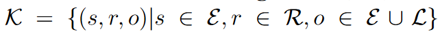
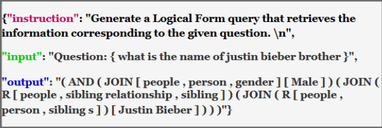
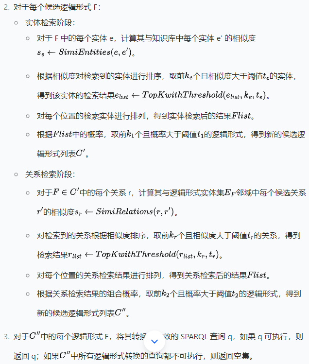

### ChatKBQA：使用微调的大型语言模型进行知识库问答的先生成后检索框架   ACL 2024

以前的知识图谱问答方法主要解决两个核心问题：知识检索（Yao 等人，2007）和语义解析（Berant 等人，2013）。

**知识检索**主要旨在根据问题从知识库中定位最相关的实体、关系或三元组，以缩小搜索范围。

**语义解析**本质上是将问题从无结构的自然语言转换为结构化的逻辑形式，然后可以将其转换为可执行的图数据库查询（例如 SPARQL（Pérez 等人，2006）），以获得精确的答案和可解释的路径。

本篇文章是基于**语义解析**的

（i）检索效率低。传统方法首先确定候选实体的范围，然后进行实体检索和关系检索。由于自然语言问题的结构与知识库事实不同，大多数方法需要训练专门的模型进行提取和链接，效率低下。

（ii）不正确的检索结果会误导语义解析。以前的方法将检索到的三元组也作为输入与原始问题一起参考序列到序列模型。然而，由于检索到的三元组并不总是准确的，它们会对语义解析结果产生不利影响。此外，如果有大量检索到的三元组，序列到序列模型需要更长的上下文长度。

（iii）多个处理步骤使知识库问答成为一项冗余复杂的任务。

### 方法

知识库：

其中 s 是一个实体，r 是一个关系，o 可以是一个实体或一个字面量。

首先，ChatKBQA 框架需要通过指令调优，**基于知识库问答数据集中的（自然语言问题、逻辑形式）对，高效地微调开源大语言模型**。然后，微调后的大语言模型**通过语义解析将新的自然语言问题转换为相应的候选逻辑形式**。接着，ChatKBQA 在**短语级别检索这些逻辑形式中的实体和关系**，并在转换为 SPARQL 后搜索可以针对知识库执行的逻辑形式。最后，转换后的 SPARQL 生成最终的答案集。

#### 微调LLM

首先针对训练集中的自然语言问题对应的SPARQL语句转换为等效的逻辑形式。

贾斯汀・比伯的兄弟叫什么名字？这个自然语言转换为：

"(AND (JOIN [ people, person, gender ] [ Male ]) (JOIN (R [ people, sibling relationship, sibling ]) (JOIN (R [ people, person, sibling s ]) [ Justin Bieber ])))")

#### Ents 和 Rels 的无监督检索

由于经过微调的大语言模型对于逻辑形式骨架具有强大的生成能力，我们在检索阶段采用无监督检索方法。该方法涉及对候选逻辑形式中的实体和关系进行短语级语义检索和替换。结果是一个最终的逻辑形式

输入：由LLM 生成的候选逻辑形式C，top-k阈值$k_e$，$k_r$，$k_1$，$k_2$概率阈值$t_e$，$t_r$，$t_1$, $t_2$, KB的实体集$\varepsilon$

#### 数据集：

 4737 个带有 SPARQL 查询的自然语言问题的 WebQuestionsSP（WebQSP）

34689 个带有 SPARQL 查询的自然语言问题的 ComplexWebQuestions（CWQ）（Talmor 和 Berant，2018）。

两个数据集均基于 Freebase（Bollacker 等人，2008）知识图谱。

