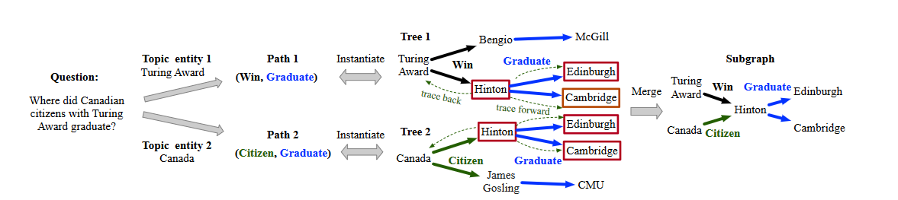
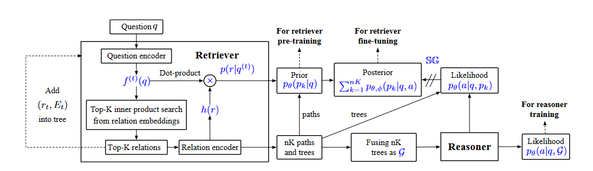

### 多跳知识库问答的子图检索增强模型   ACL 2022

小子图可能会排除答案，但大子图可能会引入更多噪音

知识图谱问答（KBQA）旨在从 Freebase、Wikidata 和 DBPedia 等结构化知识图谱中寻找事实性问题的答案。

基于语义解析（SP-based）的方法（Das 等人，2021；Lan 和 Jiang，2020；Sun 等人，2020）

基于嵌入的方法（He 等人，2021；Sun 等人，2018，2019）是解决知识图谱问答的两种主流方法。

前者严重依赖于中间逻辑形式（如 SPARQL）的昂贵标注。后者不进行问题解析，而是直接表示。并根据与输入问题的相关性对实体进行排序

**作者贡献**：

- 提出了一种**可训练的子图检索器（SR）**，它与后续的推理器解耦，以实现一个即插即用的框架，用于增强任何面向子图的推理器。
- 通过一个简单而有效的双编码器设计了子图检索器（SR），与现有的检索方法相比，它在检索和问答结果方面取得了显著更好的效果。
- 配备了子图检索器（SR）的神经符号机（NSM），通过弱监督预训练和端到端微调，在基于嵌入的知识库问答方法中实现了新的最先进性能。

### 相关工作

知识图谱问答（KBQA）解决方案可分为**基于语义解析（SP）的方法**和**基于嵌入的方法**。

**基于 SP 的方法**将问题解析为可在知识图谱上执行的逻辑形式。这些方法需要将昂贵的逻辑形式标注为监督信息，或者局限于具有少量逻辑谓词的狭窄领域。

**基于嵌入的方法**将实体嵌入并根据它们与问题的相关性进行排序，其中实体从整个知识图谱中提取或限制在子图中。

### 问题定义

知识库将信息定义为：$G=\left\{\left(e, r, e^{\prime}\right) \mid e, e^{\prime} \in E, r \in R\right\}$ ，其中$E $和$R$分别表示实体集和关系集。

对于一个问题$q $和答案之一$a \in A_{q}$，作者认为问题可以表示为：$p(a \mid G, q)$。$G$表示图谱

检索一个子图$\mathcal{G} \subseteq G$并且在子图上推理，那么问题就变为：

$$
p(a \mid G, q)=\sum_{\mathcal{G}} p_{\phi}(a \mid q, \mathcal{G}) p_{\theta}(\mathcal{G} \mid q).
$$

子图检索器：$p_{\theta}(\mathcal{G} \mid q)$、答案推理器：$p_{\phi}(a \mid q, \mathcal{G})$。

那么问题转换为找到能够检索器和推理器的最优参数。

$$
\mathcal{L}(\theta, \phi)=\max _{\theta, \phi} \sum_{(q, a, G) \in \mathcal{D}} \log \sum_{\mathcal{G}} p_{\phi}(a \mid q, \mathcal{G}) p_{\theta}(\mathcal{G} \mid q)
$$

因为检索器可以和推理器解耦，所以公式变为：

$$
\mathcal{L}(\theta, \phi)=\max _{\theta, \phi} \sum_{(q, a, \mathcal{G}) \in \mathcal{D}} \log p_{\phi}(a \mid q, \mathcal{G})+\log p_{\theta}(\mathcal{G} \mid q)
$$

### 子图检索器

主题实体中扩展与 q 相关的前 K 条路径，然后根据这些路径诱导子图。

假设有一个问题$q$，将问题输入 RoBERTa 得到$f(q)$，计算知识库中各个关系$r$与问题的相关性得分$s(q, r)=f(q)^{\top} h(r)$。然后扩充与问题最相关的关系，该关系和主题实体相连可以得到一条路径$p^{(1)}$。

将原始问题与已扩展的关系连接为新的输入$f\left(q^{(1)}\right)=\operatorname{RoBERTa}([q ; p^{(1)}\left.]]\right)$。再次计算各关系与新问题嵌入的相关性得分，以确定下一个扩展关系。若$p\left(r \mid q^{(1)}\right)>0.5$则继续扩展路径。

通过对每个主题实体进行这样的路径扩展操作，并执行束搜索，比如每个主题实体保留前 K个路径，最终得到多个路径及对应的树结构。

“Where did Canadian citizens with Turing Award graduate”

从这句话中我们得到两个主题实体，“Turing Award”和“Canada”

首先针对主题1 “Turing Award”我们计算关系$r$与问题的相关性得分，得到关系“Win”是最相关的，并且“Turing Award”和“Win”可以得到一条路径，我们将这个路径和问题结合作为新的输入，再次计算和各个关系的相似度$f\left(q^{(1)}\right)=\operatorname{RoBERTa}([q ; p^{(1)}\left.]]\right)$，得到“Graduate”这个关系，然后组成新的关系，以此类推，直到输入和关系的相似度小于0.5，那么停止扩展。同时每个主题实体我们保留前K个路径。

### 训练策略

#### 弱监督训练

鉴于难以获取真实子图，依据$(q,a)$对构建弱监督信号。针对问题的各主题实体，检索至各答案的全部最短路径充任监督信号，因获取路径比获取完整图简便。

将路径$p=\left(r_{1}, \cdots, r_{|p|}\right)$拆解成$|p|+1$个（问题，关系）比如：$\left([q], r_{1}\right) 、\left(\left[q ; r_{1}\right], r_{2}\right)$，作为数据进行训练。

#### 无监督预训练

当$(q,a)$对较少时，利用无监督方式训练检索器，利用NYT数据集构造伪$(q,a,p)$

