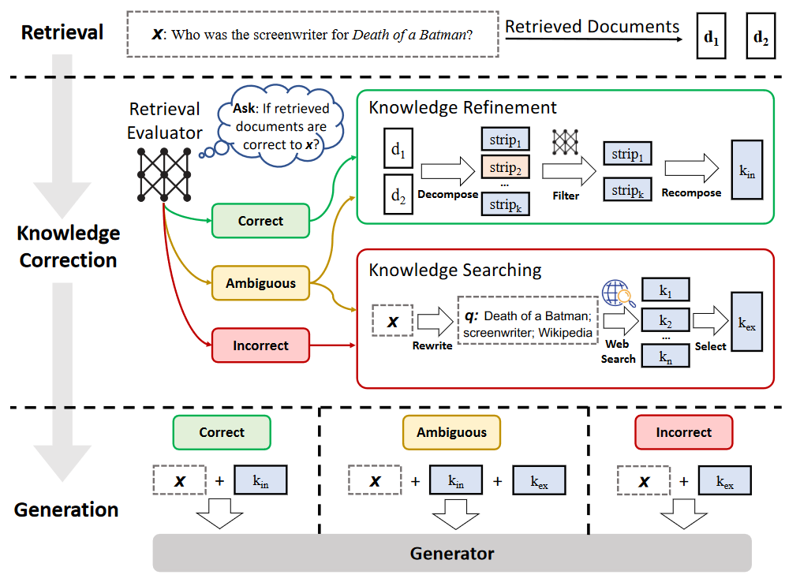

# Corrective Retrieval Augmented Generation
[https://github.com/HuskyInSalt/CRAG/tree/main](https://github.com/HuskyInSalt/CRAG/tree/main)

[https://arxiv.org/pdf/2401.15884.pdf](https://arxiv.org/pdf/2401.15884.pdf)

大型语言模型（LLMs）在生成文本时不可避免地会出现幻觉现象，因为其生成内容的准确性无法单靠模型参数中的知识来保证。尽管检索增强生成（RAG）是 LLMs 的一种实用补充，但其效果在很大程度上取决于检索到的文档的相关性，这也引发了人们对检索出错时模型表现的担忧。




- **输入与要求**：
    - 需要三个组件，分别是检索评估器 `E`、查询重写器 `W` 和生成器 `G`。输入为一个问题 `x` 以及通过检索得到的文档集合 `D = {d1, d2,..., dk}`。
- **算法步骤**：
    - 第一步：对于检索到的每一个文档 `di`（`di ∈ D`），使用检索评估器 `E` 来评估问题 `x` 和文档 `di` 之间的相关性，并得到相应的分数 `scorei`。这一步是为了量化每个文档与问题的关联程度。
    - 第二步：根据第一步得到的所有分数 `{score1, score2,...scorek}` 计算并给出一个最终的判断结果 `Confidence`。这个结果有三种可能的值：`[CORRECT]`（表示检索结果正确）、`[INCORRECT]`（表示检索结果不正确）或 `[AMBIGUOUS]`（表示结果不明确）。判断的依据是预先设定的与分数相关的阈值等条件。
    - 第三步：根据 `Confidence` 的值进行不同的操作。
        - 如果 `Confidence == [CORRECT]`，说明至少有一个检索到的文档是高度相关的。此时调用 `Knowledge_Refine` 函数对输入 `x` 和文档集合 `D` 进行处理，得到内部知识 `Internal_Knowledge`，并将其赋值给 `k`。这个 `Knowledge_Refine` 函数可能涉及对相关文档的进一步筛选、提炼关键信息等操作，以便为后续生成提供更准确的知识。
        - 如果 `Confidence == [INCORRECT]`，意味着所有检索到的文档都不相关。这时使用查询重写器 `W` 重写问题 `x` 以便进行网络搜索，通过 `Web_Search` 函数得到外部知识 `External_Knowledge`，并将其赋值给 `k`。网络搜索是为了从更广泛的资源中获取可能相关的信息来弥补检索失败的情况。
        - 如果 `Confidence == [AMBIGUOUS]`，表示难以确定检索结果的准确性。首先对输入 `x` 和文档集合 `D` 进行 `Knowledge_Refine` 操作得到内部知识 `Internal_Knowledge`，同时使用查询重写器 `W` 重写问题 `x` 进行网络搜索得到 `External_Knowledge`，最后将两者相加赋值给 `k`。这样做是为了综合利用可能相关的内部和外部知识，以增加生成结果的可靠性。
    - 第四步：最后，使用生成器 `G` 根据输入问题 `x` 和经过处理得到的知识 `k` 来生成最终的响应 `y`。生成器会利用这些知识生成符合问题需求的文本答案。


在检索到的文档不相关时进行纠正。具体而言，采用 T5-large（Raffel 等人，2020）对检索评估器进行初始化并进行微调。


将检索的文档片段再做切分，切分成几个句子，然后用微调后的检索评估器计算每个句子的相关度得分，基于这些得分，无关的知识片段被过滤掉，而相关的片段则通过按顺序连接进行重组，即内部知识。


根据代码解析：

如果`[CORRECT]`

代码参考:

[https://github.com/HuskyInSalt/CRAG/blob/main/scripts/internal_knowledge_preparation.py](https://github.com/HuskyInSalt/CRAG/blob/main/scripts/internal_knowledge_preparation.py)

首先是对文档进行切分，没啥可说的，代码写的不是很好，将切分后的结果输入T5中进行评分，取top k作为返回的结果。

```Python
input_content = query + " [SEP] " + p
inputs = tokenizer(input_content, return_tensors="pt",padding="max_length",truncation=True,max_length=max_length)
try:
  with torch.no_grad():  
    outputs = model(inputs["input_ids"].to(device),attention_mask=inputs["attention_mask"].to(device))
  scores = float(outputs["logits"].cpu())
except:
  scores = -1.0
strips_data.append((scores, p, i))
```

T5直接输出分数。


如果是`[INCORRECT]`

代码参考：

[https://github.com/HuskyInSalt/CRAG/blob/main/scripts/external_knowledge_preparation.py](https://github.com/HuskyInSalt/CRAG/blob/main/scripts/external_knowledge_preparation.py)

利用prompt+ChatGPT提取问题的关键词，然后根据关键词搜索，得到搜索结果后，再将结果输入T5中进行评分，取top k作为返回的结果。


### 总结

代码缺乏参考意义，没有RAG整体流程，这个方法调用大模型的次数太多，检索的时候调用了T5，还有GPT，回答问题还得调用模型，没有太大参考意义，可以看的点：**如何微调T5**

微调T5-large

T5-large参数量为0.7B

模型下载后有2.8G（应该是按照fp32存储的，0.7*4=2.8G）

用A800训练，80G显存

训练时显存应该占据：2.8*4=11.2G

bs为1时，占据显存14.8G

**数据格式如下**：

```Markdown
What is George Rankin's occupation? [SEP] He died in Windsor in 1893. Arthur Rankin Arthur Rankin (1816 – March 13, 1893) was a surveyor, entrepreneur and political figure in Canada West. Rankin was born in Montreal in 1816, the son of Irish immigrants. He ran away from home and became a cabin boy. In 1835, he returned to Canada, then qualified as a surveyor and moved to the Windsor area. In 1837, he smuggled an escaped slave from Ohio to Upper Canada. He served in the militia during the 1837 Rebellions. In 1843, with nine Ojibwas, he toured Britain with a "wild west show" that appeared       0
What is George Rankin's occupation? [SEP] war, Rankin was sent to Egypt to suppress a rebellion, after which he returned to Australia. He returned to the Militia, becoming a brigadier in 1936 and a major general in 1937. During this time, he developed an interest in politics, in particular the Country Party. Rankin was elected chief president of the Victorian United Country Party (VUCP) in 1937, but resigned later that year in order to contest the seat of Bendigo in the Australian House of Representatives. He was elected, and became part of the faction of the Country Party that advocated coalition with the United Australia Party.    1
```

数据分为三部分，`[SEP]`之前为query，`[SEP]`之后为passage，最后为label，passage和query相关则为1，不相关则为0。

```Python
model = T5ForSequenceClassification.from_pretrained(model_path, num_labels=1)
```

使用的是`T5ForSequenceClassification`，由`T5Model`和`T5ClassificationHead`组成

```Python
self.transformer = T5Model(config)
self.classification_head = T5ClassificationHead(config)
```

模型的输入为：query+passage

输出为：label

